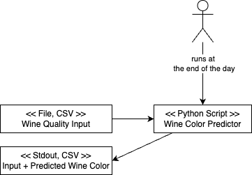
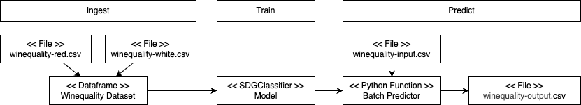
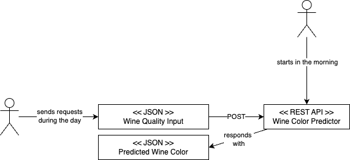
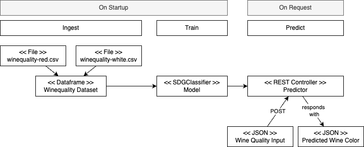

# White & Red Wine Classification, Train / Run Fashion

## User Story 1: Nightly Prediction of Wine Color Based on Chemical Wine Data

Professor Monochrome works at the Uncorked Science labs. He is responsible for the chemical analysis of wines, sent by wineyards to the lab. Unfortunately, he is color-blind, but ashamed to admit that. He therefore recruits you, a passionate Machine Learning Engineer, in order to provide him a tool telling him if a bottle of wine contains red or white wine.

As an input, the professor provides chemical analyisis data for red and white wines:
- [winequality-red.csv](data/winequality-red.csv.csv)
- [winequality-white.csv](data/winequality-white.csv)

At the end of the day, he wants to pass a similar file to the tool, which should then output the same data with an additional column predicting if the wines are red or white wines.

### System Architecture & Design

After having some talks to the Professor, you find out that he has a Python installation on his computer and that he is quite good using CLI tooling. So you decide for the simplest possible solution as a first step. 



All steps from ingesting data, training the model and predicting is done within a single execution of the script:



## User Story 2: Quick Prediction of Wine Color of a Single Wine

Your prediction CLI job is a tremendous success. Running the CLI job, however, takes more than 15 minutes and from time to time, Professor Monochrome needs to know the color of a single wine quickly right after gathering it's chemical details. He asks you for a solution that can provide this information as fast as possible. 

### System Architecture & Design

After doing some analysis, you find out that the training of the model takes 99% of all the time. You also find out that the Professor can quickly provide the data in JSON format. So you decide to provide a REST API server that can be started in the morning and after the initial training is kept up and running for the rest of the day. 





## User Story 3: Quick Prediction of Wine Color of a Single Wine

After some incidents, a new IT guideline is rolled out across computers of Uncorked Science labs that makes it impossible for Professor Monochrome to run your Python scripts anymore. He asks you for yet another solution so that he is still able to use the predictor. 

### System Architecture & Design

You find out, that due to it's isolated environment, execution of Docker containers is still allowed. So you decide to package the predictors into Docker images. No changes to the architecture and design are required.

## Setup

```
# Create and activate a virtual environment
python -m venv .venv
source .venv/bin/activate

# Install runtime requirements and add project in edit mode
pip install -e .
# Install development and test requirements
pip install .[dev]
pip install .[test]
```

## Notebook environment

Run `jupyter notebook` to work with the notebooks without IDE.

When using an IDE, make sure that the IDE is configured to use the project's virtual environment and that that the notebook working directory is the directory where the notebook files is located.

## Testing 

Run `pytest`.

## CLI Prediction

To predict the wine color using Python, run 
`python wine_color_predictor/cli_predictor.py data/winequality-cli-predictor-input.csv`
or run
`wine-color-predictor data/winequality-cli-predictor-input.csv`

To build the `wine-color-cli-predictor` image, run `sh build-cli-predictor-image.sh`. 
To predict the wine color using the `wine-color-cli-predictor` image, run 
`sh run-cli-predictor-container.sh data/winequality-cli-predictor-input.csv`

## REST API Prediction

To run the REST API predictor in development mode, run 
`uvicorn wine_color_predictor.rest_api_predictor:app --reload`. 

To build the `wine-color-rest-api-predictor` image, run `sh build-rest-api-predictor-image.sh`. 
To run the ``wine-color-rest-api-predictor`, run `sh run-rest-api-predictor-container.sh`. 

To predict using the REST API predictor, run 
```
curl -X 'POST' \
  'http://localhost:8000/predict' \
  -H 'accept: application/json' \
  -H 'Content-Type: application/json' \
  -d @data/winequality-rest-api-predictor-input.json | jq '.'
```

## Working With the GitHub Packages Container Registry

### Using the Terminal 

In order to authenticate, you need to create a personal access token. Follow the steps as outlined here: https://docs.github.com/en/packages/working-with-a-github-packages-registry/working-with-the-container-registry#authenticating-with-a-personal-access-token-classic

Build the Docker image by running (replace peterrietzler with your GitHub name)
`docker build -f docker/cli-predictor/Dockerfile -t ghcr.io/peterrietzler/wine-color-cli-predictor:1.0.0 .`

And finally push it by running (replace peterrietzler with your GitHub name)
`docker push ghcr.io/peterrietzler/wine-color-cli-predictor:1.0.0`

You can then run it, using 
`docker run --rm ghcr.io/peterrietzler/wine-color-cli-predictor:1.0.0 data/winequality-cli-predictor-input.csv`

### Using GitHub Actions

See https://docs.github.com/en/actions/use-cases-and-examples/publishing-packages/publishing-docker-images#publishing-images-to-github-packages

## Background Material 

- More info on `pyproject.toml`: https://setuptools.pypa.io/en/latest/userguide/pyproject_config.html